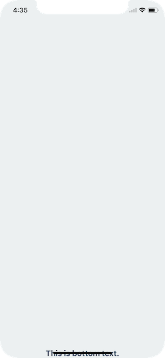
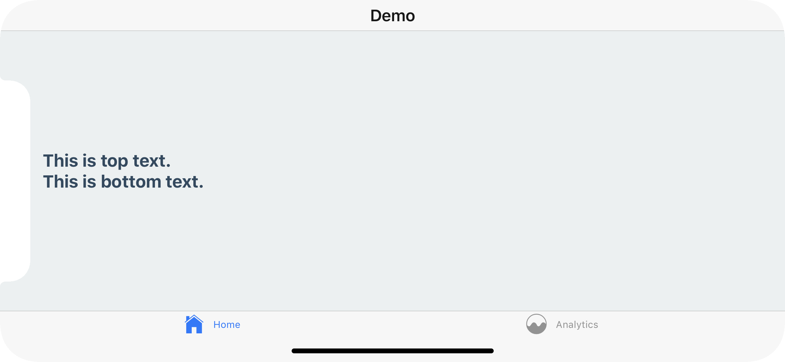

# UI / UX Guide

## Environment Setup and Basic Git Commands

<details>
  <summary>Click to expand!</summary>

## Step 1.a: Basic Installation for new project

### Install `Expo Go` app from the App store on to your phone

<details>
  <summary>Click to expand!</summary>


</details>

### Install expo client in global

<details>
  <summary>Click to expand!</summary>

- In the terminal, run the following code

  > npm install -g expo-cli

- example

  

</details>

### Create a new project with expo client

<details>
  <summary>Click to expand!</summary>

- In the terminal, run the following code

  - project name for this case is `ui-ux-guide`
  - add `--npm` to use npm install, default is yarn

  > expo init ui-ux-guide --npm

  - select the project template type using the keyboard arrow keys, then press enter to execute

- example

  

</details>

## Step 1.b: Basic Installation for existing project

### Git Clone existing repository from Github on to your pc

<details>
  <summary>Click to expand!</summary>

1. Go to the existing repository URL
2. Click on the green button `Code`
3. A dropdown will appear, click on the copy button
4. Go to the terminal and type the following command and paste the copied text after the command

   - example: `git clone git@github.com:reshinto/ui-ux-guide.git`

   > git clone

5. Make sure you cd into the newly cloned directory
   > cd ui-ux-guide

- example

  

</details>

### Install required dependencies for the app to run

<details>
  <summary>Click to expand!</summary>
  
- In the terminal, run the following code
  > npm install

- example

  

</details>

## Step 2: Run App

### Run expo app on your pc

<details>
  <summary>Click to expand!</summary>

- First check if you are in `ui-ux-guide` folder

  - If you followed the example in Step 1, run the following code in the terminal
    > cd ui-ux-guide

- To run the app execute the following code in the terminal

  > npm start

- Take your Iphone and open a QR code reader and use it to scan the QR code

- example: run server

  

- example: run mobile app

  

</details>

## Step 3: Saving Changes with Git

<details>
  <summary>Click to expand!</summary>

- In the terminal, run the following commands

  1. Check the current status to see what files need to be saved

     > git status

  2. Add all modified files into the staging area
     > git add .
  3. Check if all files has been added to the staging area, this is to prepare the saving process
     > git status
  4. Save the modified files via commit with a message to explain what this file changes is about
     > git commit -m "some text message"

- example

  

</details>

## Step 4: Push Code to Github

### Create a new repository on Github

<details>
  <summary>Click to expand!</summary>

1. Login to Github
2. Click on the top right icon of the page that looks similar to your profile picture
3. A list of selections will appear, click on `Your repositories`
4. Click on the green button `New` on the top right section of the page
5. Fill in the project name aka `Repository Name`
6. If repository name is accepted by Github, you can click on the green button `Create repository` to complete the new repository creation

- example

  

</details>

### Push to Github for the first time

<details>
  <summary>Click to expand!</summary>

1. Copy the git remote command and paste it into the terminal
   - This is to link github repository with your code in your pc
   - example: `git remote add origin git@github.com:reshinto/ui-ux-guide.git`
2. Push the code to Github with git push
   > git push -u origin master

- example

  

</details>

### Push to Github from the second time onwards

<details>
  <summary>Click to expand!</summary>

- Push the code to Github with git push

> git push

- example

  

</details>

</details>

## React Basics

<details>
  <summary>Click to expand!</summary>
  
## React fundamentals
### HTML DOM vs React Virtual DOM
<details>
  <summary>Click to expand!</summary>


- Building a webpage is similar to building a house
  - Building a house: you plan a specific floor layout, choose the colors to paint the walls, and buy the furnitures and appliances you want to use, etc.
  - Building a webpage: you design the page by planning which and where components should be placed, choose the colors, and decide on what kind of features to implement, etc.
- HTML
  ```html
  <!DOCTYPE html>
  <html lang="en">
    <head></head>
    <body>
      <ul class="list">
        <li class="list__item">List item</li>
      </ul>
    </body>
  </html>
  ```
- HTML DOM representation

  

- React Virtual DOM representation
  ```javascript
  const vdom = {
    tagName: "html",
    children: [
      {tagName: "head"},
      {
        tagName: "body",
        children: [
          {
            tagName: "ul",
            attributes: {class: "list"},
            children: [
              {
                tagName: "li",
                attributes: {class: "list__item"},
                textContent: "List item",
              }, // end li
            ],
          }, // end ul
        ],
      }, // end body
    ],
  }; // end html
  ```
  

#### How updating of the HTML DOM affects the building process of the webpage


- whenever you need to make changes, you would need to rebuild the entire webpage again
- Similarly, when you need to make any changes (small or large), you would need to rebuild the entire house again
- The disadvantage of doing so is that it would take up time to rebuild everything, even though you had only made 1 small change

#### How React Virtual DOM speed up the updating process of the HTML DOM

- React copies the HTML DOM to create the virtual DOM so as to make it easy to make changes by following the form of a tree data structure

  

  - only the affected node and it's child nodes will be updated, while the rest of the node remains unchanged

- Similarly for a house, it can be broken down into a tree data structure as well

  

  - When a room needs to be modified, only that room will be rebuilt, while the rest of the house will be left untouched
  - in the event where you want the items (child nodes) in the room to remain unchanged, and only modify the room, you would need to specify that you wish to do so
    - otherwise, by default, when a room gets rebuilt, everything inside will be rebuilt together with the room

- example of how virtual DOM behaves

  

</details>

### React Thinking: thinking in components

<details>
  <summary>Click to expand!</summary>


#### Break the UI into Components


1. FilterableProductTable (orange): contains the entirety of the example
2. SearchBar (blue): receives all user input
3. ProductTable (green): displays and filters the data collection based on user input
4. ProductCategoryRow (turquoise): displays a heading for each category
5. ProductRow (red): displays a row for each product

</details>

### Basic React: props, state, lifecycles

<details>
  <summary>Click to expand!</summary>

- Props

  - data parsed from the parent node to the child node
  - value cannot be directly modified
  - example: parent node

    ```javascript
    import React, {useState} from "react";
    import ChildNode from "./ChildNode";

    function ParentNode() {
      const [count, setCount] = useState(0); // 0 = initial state
      const handleClick = () => {
        setCount(count + 1);
      };
      return <ChildNode handleClick={handleClick} count={count} />;
    }

    export default ParentNode;
    ```

    - child node

    ```javascript
    import React, {useState} from "react";

    function ChildNode(props) {
      const {handleClick, count} = props;
      return <div onClick={handleClick}>{count}</div>;
    }

    export default ParentNode;
    ```

- State and lifecycles
  - [basic react reference guide](https://github.com/reshinto/Basic_technologies_revision/blob/master/react/readme.md)

</details>

</details>

## CSS defaults

<details>
  <summary>Click to expand!</summary>

- In a Web or Mobile app, there is CSS default styles built-in
  - this results in your app appearing different across different browsers or mobile phone / OS (ios, android), even when the css code is exactly the same
- CSS Reset or normalize would be required to either reset the values to nothing or make css values to be dynamic which changes according to browser or mobile OS / phone type

### Web

<details>
  <summary>Click to expand!</summary>

- [default css value reference](https://www.w3schools.com/cssref/css_default_values.asp)

- there are many different types of CSS reset or normalize configurations

  - 1 example: [meyer web css reset config](https://meyerweb.com/eric/tools/css/reset/)

- example of not using CSS reset or normalize

  [test page without CSS reset](http://web.simmons.edu/~grovesd/comm244/notes/week3/html-test-page.html)

  

- example of using CSS reset or normalize

  [test page with CSS reset](http://web.simmons.edu/~grovesd/comm244/notes/week4/normalize-example.html)

</details>

### Mobile

<details>
  <summary>Click to expand!</summary>

- Iphone on the same phone

  - for this example both without normalize and normalized will look the same on the same Iphone model, however it would look different for different Iphone models

    - note that Iphone Activity Indicator is different from Android

    

- Android on the same phone

  - without normalize

    - note that Activity Indicator did not appear by default, color settings need to declared to display it
    - Text and Activity Indicator is not centralized which is not the desired effect

    

  - with normalize

    - color settings need not be declared and appears gray by default
    - Text and Activity Indicator is centralized which is the desired effect

    

- example libraries

  - Tool to normalize values in CSS

    [documentation](https://www.npmjs.com/package/react-native-normalize)

    > npm i react-native-normalize

    - example

    ```javascript
    import React from "react";
    import {StyleSheet, View, Text} from "react-native";
    import normalize from "react-native-normalize";

    export default function App() {
      return (
        <View style={styles.box}>
          <Text style={styles.text}>Hello World!</Text>
        </View>
      );
    }

    const styles = StyleSheet.create({
      box: {
        top: normalize(180, "height"),
        left: normalize(40),
        width: normalize(300),
        height: normalize(300),
        alignItems: "center",
        justifyContent: "center",
      },
      text: {
        fontSize: normalize(30),
      },
    });
    ```

  - Ready to use but limited UI Components with normalized CSS

    [documentation](https://www.npmjs.com/package/react-native-normalized)

    > npm i react-native-normalized

    - example

    ```javascript
    import React from "react";
    import {StyleSheet} from "react-native";
    import {View, Text} from "react-native-normalized";

    export default function App() {
      return (
        <View style={styles.box}>
          <Text style={styles.text}>Hello World!</Text>
        </View>
      );
    }

    const styles = StyleSheet.create({
      box: {
        top: 180,
        left: 40,
        width: 300,
        height: 300,
        alignItems: "center",
        justifyContent: "center",
      },
      text: {
        fontSize: 30,
      },
    });
    ```

</details>

</details>

## Screen Navigation

<details>
  <summary>Click to expand!</summary>

## React Native


### React Native: Step 1: Set Safe Area

<details>
  <summary>Click to expand!</summary>

- The purpose is to render content within the safe area boundaries of a device
- Install `react-native-safe-area-context` library

  - [documentation](https://docs.expo.dev/versions/latest/sdk/safe-area-context/)
  - if using expo
    > expo install react-native-safe-area-context
  - if using bare react-native
    > npm install react-native-safe-area-context

- Implementation

  1. Set `SafeAreaProvider`

     - provides system elements (status bar, notches, etc.) to consumers (`SafeAreaView`, `useSafeAreaInsets`)
     - have one provider at the top of app
     - should add `SafeAreaProvider` in app root component
       - may need to add it in other places like the root of modals and routes when using `react-native-screens`
     - providers should not be inside a `View` that is animated with `Animated` or inside a `ScrollView` as it can cause very frequent updates
     - accepts all `View` props
     - has a default style of `{flex: 1}`

     ```javascript
     import React from "react";
     import {SafeAreaProvider} from "react-native-safe-area-context";

     export default function App() {
       return <SafeAreaProvider></SafeAreaProvider>;
     }
     ```

  2. Set `SafeAreaView`

     - do not user `SafeAreaView` from `react-native` library as the safe area insets are not auto added
     - a regular `View` component with the safe area insets applied as padding or margin
     - without Safe Area
       
       
     - with Safe Area
       
       

     - example

       ```javascript
       import React from "react";
       import {StyleSheet} from "react-native";
       import {
         SafeAreaProvider,
         SafeAreaView,
       } from "react-native-safe-area-context";

       export default function App() {
         return (
           <SafeAreaProvider>
             <SafeAreaView style={styles.container}></SafeAreaView>
           </SafeAreaProvider>
         );
       }

       const styles = StyleSheet.create({
         container: {
           flex: 1,
         },
       });
       ```

</details>

### React Native: Step 2a: Set Navigation Container

<details>
  <summary>Click to expand!</summary>

- contains core utilities used by navigators to create the navigation structure in app
- Install `@react-navigation/native` library

  - [documentation](https://reactnavigation.org/docs/getting-started/)

  > npm install @react-navigation/native

- example

  - path: `./shared/components/Navigation/index.tsx`

    ```javascript
    import React from "react";
    import {NavigationContainer} from "@react-navigation/native";

    function Navigation() {
      return <NavigationContainer></NavigationContainer>;
    }

    export default Navigation;
    ```

  - import `Navigation` to root app component

    ```javascript
    import React from "react";
    import {StyleSheet} from "react-native";
    import {
      SafeAreaProvider,
      SafeAreaView,
    } from "react-native-safe-area-context";
    import Navigation from "./shared/components/Navigation";

    export default function App() {
      return (
        <SafeAreaProvider>
          <SafeAreaView style={styles.container}>
            <Navigation />
          </SafeAreaView>
        </SafeAreaProvider>
      );
    }

    const styles = StyleSheet.create({
      container: {
        flex: 1,
      },
    });
    ```

</details>

### React Native: Step 2b: Set screen links config

<details>
  <summary>Click to expand!</summary>

- Install `expo-linking` library

  - [documentation](https://docs.expo.dev/versions/latest/sdk/linking/)

  > expo install expo-linking

- Implementation

  - Link the app
    - specify a scheme for app
    - can register for a scheme in the `app.json` by adding a string under the scheme key (use only lower case)
    - [documentation](https://docs.expo.dev/guides/linking/#linking-to-your-app)
    - example
      - links can be opened with `myapp://`
      ```json
      {
        "expo": {
          "scheme": "myapp"
        }
      }
      ```
  - Configure links

    - configure React Navigation to handle internal screens or external links

    - [documentation](https://reactnavigation.org/docs/configuring-links)

    - example

      - navigation types (not required if not using typescript)

        - path: `../../shared/components/Navigation/navigationTypes.tsx`

          ```typescript
          import {NativeStackScreenProps} from "@react-navigation/native-stack";

          export type RootStackParamList = {
            Root: undefined;
            Home: undefined;
            NotFound: undefined;
          };
          ```

      - create link configuration, add type if using `typescript`

        - path: `./LinkingConfig.ts`

          ```typescript
          import {LinkingOptions} from "@react-navigation/native";
          import {RootStackParamList} from "./navigationTypes";
          import * as Linking from "expo-linking";

          const LinkingConfig: LinkingOptions<RootStackParamList> = {
            prefixes: [Linking.makeUrl("/")],
            config: {
              screens: {
                Root: "root",
                Home: "home",
                NotFound: "*",
              },
            },
          };

          export default LinkingConfig;
          ```

      - add link config to navigation

        ```javascript
        import React from "react";
        import {NavigationContainer} from "@react-navigation/native";
        import LinkingConfig from "./LinkingConfig";

        function Navigation() {
          return (
            <NavigationContainer linking={LinkingConfig}></NavigationContainer>
          );
        }

        export default Navigation;
        ```

</details>

### React Native: Step 3: Set Root Navigator

<details>
  <summary>Click to expand!</summary>

- Install `@react-navigation/native-stack` library

  - [documentation](https://reactnavigation.org/docs/native-stack-navigator/)

  > npm install @react-navigation/native-stack

- Must install additional dependency `react-native-screens` library

  - [documentation](https://github.com/software-mansion/react-native-screens)

  - if using expo
    > expo install react-native-screens
  - if using bare React-native
    > npm install react-native-screens

- Implementation

  - Create screens

    - example

      - navigation types (not required if not using typescript)

        - path: `../../shared/components/Navigation/navigationTypes.tsx`

          ```typescript
          import {NativeStackScreenProps} from "@react-navigation/native-stack";

          export type RootStackParamList = {
            Root: undefined;
            Home: undefined;
            NotFound: undefined;
          };

          export type RootStackScreenProps<
            Screen extends keyof RootStackParamList
          > = NativeStackScreenProps<RootStackParamList, Screen>;
          ```

      - Root Screen

        - path: `../../../screens/RootScreen/index.tsx`

          ```typescript
          import React from "react";
          import {StyleSheet, View, Button, Text} from "react-native";
          import normalize from "react-native-normalize";
          import {NativeStackScreenProps} from "@react-navigation/native-stack";
          import {RootStackScreenProps} from "../../shared/components/Navigation/navigationTypes";

          function RootScreen({navigation}: RootStackScreenProps<"Root">) {
            return (
              <View style={styles.box}>
                <Text style={styles.text}>Hello World 1!</Text>
                <Button
                  title="Go to Home"
                  onPress={() => navigation.navigate("Home")}
                />
              </View>
            );
          }

          export default RootScreen;

          const styles = StyleSheet.create({
            box: {
              height: "100%",
            },
            text: {
              height: "80%",
              fontSize: normalize(30),
            },
          });
          ```

      - Home Screen

        - path: `../../../screens/HomeScreen/index.tsx`

          ```typescript
          import React from "react";
          import {StyleSheet, View, Button, Text} from "react-native";
          import normalize from "react-native-normalize";
          import {NativeStackScreenProps} from "@react-navigation/native-stack";
          import {RootStackScreenProps} from "../../shared/components/Navigation/navigationTypes";

          function HomeScreen({navigation}: RootStackScreenProps<"Home">) {
            return (
              <View style={styles.box}>
                <Text style={styles.text}>Hello World 2!</Text>
                <Button
                  title="Go to Not Found"
                  onPress={() => navigation.navigate("NotFound")}
                />
              </View>
            );
          }

          export default HomeScreen;

          const styles = StyleSheet.create({
            box: {
              height: "100%",
            },
            text: {
              height: "80%",
              fontSize: normalize(30),
            },
          });
          ```

      - Not Found Screen

        - path: `../../../screens/NotFoundScreen/index.tsx`

          ```typescript
          import React from "react";
          import {StyleSheet, TouchableOpacity, Text, View} from "react-native";
          import {RootStackScreenProps} from "../../shared/components/Navigation/navigationTypes";

          function NotFoundScreen({
            navigation,
          }: RootStackScreenProps<"NotFound">) {
            return (
              <View style={styles.container}>
                <Text style={styles.title}>This screen doesn't exist.</Text>
                <TouchableOpacity
                  onPress={() => navigation.replace("Root")}
                  style={styles.link}
                >
                  <Text style={styles.linkText}>Go to root screen!</Text>
                </TouchableOpacity>
              </View>
            );
          }

          export default NotFoundScreen;

          const styles = StyleSheet.create({
            container: {
              flex: 1,
              alignItems: "center",
              justifyContent: "center",
              padding: 20,
            },
            title: {
              fontSize: 20,
              fontWeight: "bold",
            },
            link: {
              marginTop: 15,
              paddingVertical: 15,
            },
            linkText: {
              fontSize: 14,
              color: "#2e78b7",
            },
          });
          ```

  - Create Root Navigator

    - example

      - path: `./RootNavigator.tsx`

        ```javascript
        import React from "react";
        import {createNativeStackNavigator} from "@react-navigation/native-stack";
        import HomeScreen from "../../../screens/HomeScreen";
        import RootScreen from "../../../screens/RootScreen";
        import {RootStackParamList} from "./navigationTypes";
        import NotFoundScreen from "../../../screens/NotFoundScreen";

        function RootNavigator() {
          const Stack = createNativeStackNavigator<RootStackParamList>();

          return (
            <Stack.Navigator
              screenOptions={{
                headerShown: false,
                animation: "none",
              }}
            >
              <Stack.Screen name="Root" component={RootScreen} />
              <Stack.Screen name="Home" component={HomeScreen} />
              <Stack.Screen name="NotFound" component={NotFoundScreen} />
            </Stack.Navigator>
          );
        }

        export default RootNavigator;
        ```

  - Add Root Navigator to Navigation

    - example

      ```javascript
      import React from "react";
      import {NavigationContainer} from "@react-navigation/native";
      import LinkingConfig from "./LinkingConfig";
      import RootNavigator from "./RootNavigator";

      function Navigation() {
        return (
          <NavigationContainer linking={LinkingConfig}>
            <RootNavigator />
          </NavigationContainer>
        );
      }

      export default Navigation;
      ```

</details>

</details>
